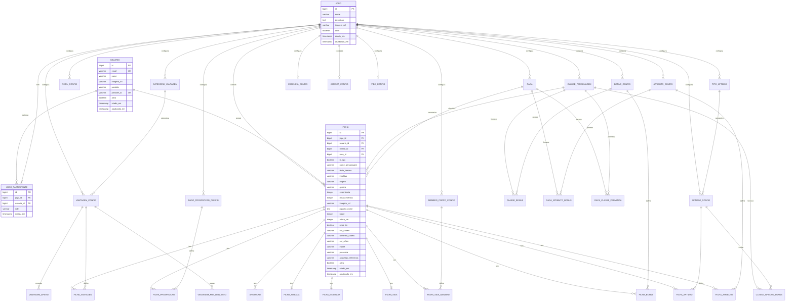

# Data Model: Klayrah RPG (Revisado)

**Feature Branch**: `001-backend-data-model`  
**Date**: 2026-02-01  
**Revisado**: 2026-02-01 - Sistema totalmente configurável, sem JSON, com histórico

## Princípios do Modelo

1. **Configuração por Jogo** - Cada jogo tem suas próprias configurações
2. **Tabelas `_CONFIG`** - Definidas pelo Mestre, aplicadas ao jogo
3. **Tabelas `FICHA_`** - Valores específicos de cada ficha
4. **Sem JSON columns** - Tudo normalizado
5. **Auditoria completa** - Hibernate Envers para histórico

---

## Entity Relationship Diagram (Mermaid)



---

## Tabelas de Configuração (Definidas pelo Mestre)

### ATRIBUTO_CONFIG

Configuração dos atributos do jogo.

| Campo | Tipo | Constraints | Descrição |
|-------|------|-------------|-----------|
| id | BIGINT | PK, AUTO_INCREMENT | Identificador único |
| jogo_id | BIGINT | FK, NOT NULL | Jogo ao qual pertence |
| nome | VARCHAR(50) | NOT NULL | Nome do atributo (ex: "Força") |
| descricao | VARCHAR(500) | | Descrição do atributo |
| formula_impeto | VARCHAR(100) | | Fórmula do ímpeto (ex: "TOTAL * 3") |
| descricao_impeto | VARCHAR(200) | | Descrição do ímpeto |
| valor_minimo | INTEGER | DEFAULT 0 | Valor mínimo permitido |
| valor_maximo | INTEGER | DEFAULT 999 | Valor máximo permitido |
| ordem_exibicao | INTEGER | DEFAULT 0 | Ordem na interface |
| ativo | BOOLEAN | DEFAULT true | Se está ativo |
| criado_em | TIMESTAMP | NOT NULL | Data de criação |
| atualizado_em | TIMESTAMP | NOT NULL | Data de atualização |

**Índices**:
- `idx_atributo_config_jogo` ON (jogo_id, ativo)
- UNIQUE (jogo_id, nome)

---

### NIVEL_CONFIG

Configuração dos níveis e progressão.

| Campo | Tipo | Constraints | Descrição |
|-------|------|-------------|-----------|
| id | BIGINT | PK, AUTO_INCREMENT | Identificador único |
| jogo_id | BIGINT | FK, NOT NULL | Jogo ao qual pertence |
| numero_nivel | INTEGER | NOT NULL | Número do nível (0, 1, 2...) |
| experiencia_necessaria | INTEGER | NOT NULL | XP para atingir este nível |
| limitador_atributo | INTEGER | NOT NULL | Valor máximo de atributo |
| pontos_atributo | INTEGER | DEFAULT 0 | Pontos para distribuir |
| descricao | VARCHAR(100) | | Descrição do nível |
| permite_renascimento | BOOLEAN | DEFAULT false | Se permite renascer |
| criado_em | TIMESTAMP | NOT NULL | Data de criação |
| atualizado_em | TIMESTAMP | NOT NULL | Data de atualização |

**Índices**:
- `idx_nivel_config_jogo` ON (jogo_id)
- UNIQUE (jogo_id, numero_nivel)

---

### TIPO_APTIDAO

Categorias de aptidões (Física, Mental, etc.)

| Campo | Tipo | Constraints | Descrição |
|-------|------|-------------|-----------|
| id | BIGINT | PK, AUTO_INCREMENT | Identificador único |
| jogo_id | BIGINT | FK, NOT NULL | Jogo ao qual pertence |
| nome | VARCHAR(50) | NOT NULL | Nome do tipo (ex: "Física") |
| descricao | VARCHAR(500) | | Descrição |
| ordem_exibicao | INTEGER | DEFAULT 0 | Ordem na interface |
| ativo | BOOLEAN | DEFAULT true | Se está ativo |
| criado_em | TIMESTAMP | NOT NULL | Data de criação |
| atualizado_em | TIMESTAMP | NOT NULL | Data de atualização |

**Índices**:
- `idx_tipo_aptidao_jogo` ON (jogo_id, ativo)
- UNIQUE (jogo_id, nome)

---

### APTIDAO_CONFIG

Configuração das aptidões do jogo.

| Campo | Tipo | Constraints | Descrição |
|-------|------|-------------|-----------|
| id | BIGINT | PK, AUTO_INCREMENT | Identificador único |
| jogo_id | BIGINT | FK, NOT NULL | Jogo ao qual pertence |
| tipo_aptidao_id | BIGINT | FK, NOT NULL | Tipo da aptidão |
| nome | VARCHAR(50) | NOT NULL | Nome da aptidão |
| descricao | VARCHAR(500) | | Descrição |
| ordem_exibicao | INTEGER | DEFAULT 0 | Ordem na interface |
| ativo | BOOLEAN | DEFAULT true | Se está ativo |
| criado_em | TIMESTAMP | NOT NULL | Data de criação |
| atualizado_em | TIMESTAMP | NOT NULL | Data de atualização |

**Índices**:
- `idx_aptidao_config_jogo` ON (jogo_id, ativo)
- `idx_aptidao_config_tipo` ON (tipo_aptidao_id)
- UNIQUE (jogo_id, nome)

---

### BONUS_CONFIG

Configuração dos bônus calculados.

| Campo | Tipo | Constraints | Descrição |
|-------|------|-------------|-----------|
| id | BIGINT | PK, AUTO_INCREMENT | Identificador único |
| jogo_id | BIGINT | FK, NOT NULL | Jogo ao qual pertence |
| nome | VARCHAR(50) | NOT NULL | Nome do bônus (ex: "B.B.A") |
| descricao | VARCHAR(500) | | Descrição |
| formula_base | VARCHAR(200) | | Fórmula base (ex: "(FORCA + AGILIDADE) / 3") |
| ordem_exibicao | INTEGER | DEFAULT 0 | Ordem na interface |
| ativo | BOOLEAN | DEFAULT true | Se está ativo |
| criado_em | TIMESTAMP | NOT NULL | Data de criação |
| atualizado_em | TIMESTAMP | NOT NULL | Data de atualização |

**Índices**:
- `idx_bonus_config_jogo` ON (jogo_id, ativo)
- UNIQUE (jogo_id, nome)

---

### MEMBRO_CORPO_CONFIG

Configuração dos membros do corpo para sistema de vida.

| Campo | Tipo | Constraints | Descrição |
|-------|------|-------------|-----------|
| id | BIGINT | PK, AUTO_INCREMENT | Identificador único |
| jogo_id | BIGINT | FK, NOT NULL | Jogo ao qual pertence |
| nome | VARCHAR(50) | NOT NULL | Nome do membro (ex: "Cabeça") |
| porcentagem_vida | DECIMAL(3,2) | NOT NULL | Porcentagem (0.25, 0.75, 1.0) |
| ordem_exibicao | INTEGER | DEFAULT 0 | Ordem na interface |
| ativo | BOOLEAN | DEFAULT true | Se está ativo |
| criado_em | TIMESTAMP | NOT NULL | Data de criação |
| atualizado_em | TIMESTAMP | NOT NULL | Data de atualização |

**Índices**:
- `idx_membro_corpo_jogo` ON (jogo_id, ativo)
- UNIQUE (jogo_id, nome)

---

### CLASSE_PERSONAGEM

Classes de personagem cadastráveis.

| Campo | Tipo | Constraints | Descrição |
|-------|------|-------------|-----------|
| id | BIGINT | PK, AUTO_INCREMENT | Identificador único |
| jogo_id | BIGINT | FK, NOT NULL | Jogo ao qual pertence |
| nome | VARCHAR(50) | NOT NULL | Nome da classe |
| descricao | TEXT | | Descrição da classe |
| nivel_minimo | INTEGER | DEFAULT 1 | Nível mínimo para usar |
| ativo | BOOLEAN | DEFAULT true | Se está ativo |
| criado_em | TIMESTAMP | NOT NULL | Data de criação |
| atualizado_em | TIMESTAMP | NOT NULL | Data de atualização |

**Índices**:
- `idx_classe_jogo` ON (jogo_id, ativo)
- UNIQUE (jogo_id, nome)

---

### CLASSE_BONUS

Bônus que uma classe fornece.

| Campo | Tipo | Constraints | Descrição |
|-------|------|-------------|-----------|
| id | BIGINT | PK, AUTO_INCREMENT | Identificador único |
| classe_id | BIGINT | FK, NOT NULL | Classe que fornece |
| bonus_config_id | BIGINT | FK, NOT NULL | Bônus que recebe |
| valor | INTEGER | NOT NULL | Valor do bônus |
| nivel_necessario | INTEGER | DEFAULT 1 | Nível para ganhar |

**Índices**:
- `idx_classe_bonus_classe` ON (classe_id)

---

### CLASSE_APTIDAO_BONUS

Bônus de aptidão que uma classe fornece.

| Campo | Tipo | Constraints | Descrição |
|-------|------|-------------|-----------|
| id | BIGINT | PK, AUTO_INCREMENT | Identificador único |
| classe_id | BIGINT | FK, NOT NULL | Classe que fornece |
| aptidao_config_id | BIGINT | FK, NOT NULL | Aptidão que recebe |
| valor | INTEGER | NOT NULL | Valor do bônus |
| nivel_necessario | INTEGER | DEFAULT 1 | Nível para ganhar |

**Índices**:
- `idx_classe_aptidao_bonus_classe` ON (classe_id)

---

### RACA

Raças cadastráveis pelo Mestre.

| Campo | Tipo | Constraints | Descrição |
|-------|------|-------------|-----------|
| id | BIGINT | PK, AUTO_INCREMENT | Identificador único |
| jogo_id | BIGINT | FK, NOT NULL | Jogo ao qual pertence |
| nome | VARCHAR(50) | NOT NULL | Nome da raça |
| descricao | TEXT | | Descrição da raça |
| ativo | BOOLEAN | DEFAULT true | Se está ativo |
| criado_em | TIMESTAMP | NOT NULL | Data de criação |
| atualizado_em | TIMESTAMP | NOT NULL | Data de atualização |

**Índices**:
- `idx_raca_jogo` ON (jogo_id, ativo)
- UNIQUE (jogo_id, nome)

---

### RACA_ATRIBUTO_BONUS

Bônus de atributo que uma raça fornece.

| Campo | Tipo | Constraints | Descrição |
|-------|------|-------------|-----------|
| id | BIGINT | PK, AUTO_INCREMENT | Identificador único |
| raca_id | BIGINT | FK, NOT NULL | Raça que fornece |
| atributo_config_id | BIGINT | FK, NOT NULL | Atributo que recebe |
| valor_bonus | INTEGER | NOT NULL | Valor (pode ser negativo) |

**Índices**:
- `idx_raca_atributo_bonus_raca` ON (raca_id)

---

### RACA_CLASSE_PERMITIDA

Classes permitidas para uma raça (opcional).

| Campo | Tipo | Constraints | Descrição |
|-------|------|-------------|-----------|
| id | BIGINT | PK, AUTO_INCREMENT | Identificador único |
| raca_id | BIGINT | FK, NOT NULL | Raça |
| classe_id | BIGINT | FK, NOT NULL | Classe permitida |

**Índices**:
- `idx_raca_classe_raca` ON (raca_id)
- UNIQUE (raca_id, classe_id)

---

### ESSENCIA_CONFIG

Configuração do sistema de essência.

| Campo | Tipo | Constraints | Descrição |
|-------|------|-------------|-----------|
| id | BIGINT | PK, AUTO_INCREMENT | Identificador único |
| jogo_id | BIGINT | FK, NOT NULL, UNIQUE | Jogo (1:1) |
| formula | VARCHAR(500) | | Fórmula de cálculo |
| descricao | VARCHAR(500) | | Descrição |
| criado_em | TIMESTAMP | NOT NULL | Data de criação |
| atualizado_em | TIMESTAMP | NOT NULL | Data de atualização |

---

### AMEACA_CONFIG

Configuração do sistema de ameaça.

| Campo | Tipo | Constraints | Descrição |
|-------|------|-------------|-----------|
| id | BIGINT | PK, AUTO_INCREMENT | Identificador único |
| jogo_id | BIGINT | FK, NOT NULL, UNIQUE | Jogo (1:1) |
| formula | VARCHAR(500) | | Fórmula de cálculo |
| descricao | VARCHAR(500) | | Descrição |
| criado_em | TIMESTAMP | NOT NULL | Data de criação |
| atualizado_em | TIMESTAMP | NOT NULL | Data de atualização |

---

### VIDA_CONFIG

Configuração do sistema de vida.

| Campo | Tipo | Constraints | Descrição |
|-------|------|-------------|-----------|
| id | BIGINT | PK, AUTO_INCREMENT | Identificador único |
| jogo_id | BIGINT | FK, NOT NULL, UNIQUE | Jogo (1:1) |
| formula | VARCHAR(500) | | Fórmula de cálculo (ex: "VIGOR + NIVEL + VANTAGENS + RENASCIMENTOS + OUTROS") |
| descricao | VARCHAR(500) | | Descrição |
| criado_em | TIMESTAMP | NOT NULL | Data de criação |
| atualizado_em | TIMESTAMP | NOT NULL | Data de atualização |

---

### DADO_PROSPECCAO_CONFIG

Configuração dos dados de prospecção disponíveis no jogo.

| Campo | Tipo | Constraints | Descrição |
|-------|------|-------------|-----------|
| id | BIGINT | PK, AUTO_INCREMENT | Identificador único |
| jogo_id | BIGINT | FK, NOT NULL | Jogo ao qual pertence |
| nome | VARCHAR(10) | NOT NULL | Nome do dado (ex: "d6", "d10") |
| valor_maximo | INTEGER | NOT NULL | Número de lados (6, 10, etc.) |
| ordem_exibicao | INTEGER | DEFAULT 0 | Ordem na interface |
| ativo | BOOLEAN | DEFAULT true | Se está ativo |
| criado_em | TIMESTAMP | NOT NULL | Data de criação |
| atualizado_em | TIMESTAMP | NOT NULL | Data de atualização |

**Índices**:
- `idx_dado_prospeccao_jogo` ON (jogo_id, ativo)
- UNIQUE (jogo_id, nome)

---

## Tabelas de Configuração de Vantagens

### CATEGORIA_VANTAGEM

Categorias de vantagens (Treinamento Físico, Mental, Ação, Reação, etc.)

| Campo | Tipo | Constraints | Descrição |
|-------|------|-------------|-----------|
| id | BIGINT | PK, AUTO_INCREMENT | Identificador único |
| jogo_id | BIGINT | FK, NOT NULL | Jogo ao qual pertence |
| nome | VARCHAR(50) | NOT NULL | Nome da categoria |
| descricao | VARCHAR(500) | | Descrição |
| ordem_exibicao | INTEGER | DEFAULT 0 | Ordem na interface |
| ativo | BOOLEAN | DEFAULT true | Se está ativo |
| criado_em | TIMESTAMP | NOT NULL | Data de criação |
| atualizado_em | TIMESTAMP | NOT NULL | Data de atualização |

**Índices**:
- `idx_categoria_vantagem_jogo` ON (jogo_id, ativo)
- UNIQUE (jogo_id, nome)

---

### VANTAGEM_CONFIG

Configuração das vantagens disponíveis no jogo.

| Campo | Tipo | Constraints | Descrição |
|-------|------|-------------|-----------|
| id | BIGINT | PK, AUTO_INCREMENT | Identificador único |
| jogo_id | BIGINT | FK, NOT NULL | Jogo ao qual pertence |
| categoria_id | BIGINT | FK, NOT NULL | Categoria da vantagem |
| nome | VARCHAR(100) | NOT NULL | Nome da vantagem |
| sigla | VARCHAR(10) | | Sigla (ex: "TCO", "TCD") |
| descricao | TEXT | | Descrição completa |
| custo_base | INTEGER | NOT NULL | Custo base para comprar/subir nível |
| formula_custo | VARCHAR(100) | DEFAULT 'CUSTO_BASE * NIVEL' | Fórmula para calcular custo por nível |
| niveis_maximos | INTEGER | DEFAULT 1 | Número máximo de níveis |
| dados_progressao | VARCHAR(50) | | Dados de progressão (ex: "1D3 + D.UP/PN") |
| notas | TEXT | | Notas adicionais |
| ordem_exibicao | INTEGER | DEFAULT 0 | Ordem na interface |
| ativo | BOOLEAN | DEFAULT true | Se está ativo |
| criado_em | TIMESTAMP | NOT NULL | Data de criação |
| atualizado_em | TIMESTAMP | NOT NULL | Data de atualização |

**Índices**:
- `idx_vantagem_config_jogo` ON (jogo_id, ativo)
- `idx_vantagem_config_categoria` ON (categoria_id)
- UNIQUE (jogo_id, nome)

---

### VANTAGEM_PRE_REQUISITO

Pré-requisitos para adquirir uma vantagem.

| Campo | Tipo | Constraints | Descrição |
|-------|------|-------------|-----------|
| id | BIGINT | PK, AUTO_INCREMENT | Identificador único |
| vantagem_config_id | BIGINT | FK, NOT NULL | Vantagem que requer |
| tipo_requisito | VARCHAR(30) | NOT NULL | Tipo: ATRIBUTO, BONUS, NIVEL_PERSONAGEM, RENASCIMENTOS, VANTAGEM |
| referencia_id | BIGINT | | ID do atributo/bonus/vantagem referenciado (NULL se tipo = NIVEL/RENASC) |
| valor_minimo | INTEGER | NOT NULL | Valor mínimo necessário |
| descricao | VARCHAR(200) | | Descrição legível (ex: "B.B.A 5+") |

**Índices**:
- `idx_vantagem_pre_req_vantagem` ON (vantagem_config_id)

---

### VANTAGEM_EFEITO

Efeitos/bônus que uma vantagem concede por nível.

| Campo | Tipo | Constraints | Descrição |
|-------|------|-------------|-----------|
| id | BIGINT | PK, AUTO_INCREMENT | Identificador único |
| vantagem_config_id | BIGINT | FK, NOT NULL | Vantagem que concede |
| tipo_efeito | VARCHAR(30) | NOT NULL | Tipo: BONUS, ATRIBUTO, APTIDAO, VIDA, ESSENCIA, REDUCAO_DANO, ESPECIAL |
| referencia_id | BIGINT | | ID do bonus/atributo/aptidao referenciado (NULL se ESPECIAL) |
| valor_por_nivel | INTEGER | | Valor do bônus por nível da vantagem |
| descricao | VARCHAR(200) | NOT NULL | Descrição legível (ex: "+1 de B.B.A por nível") |
| formula | VARCHAR(200) | | Fórmula customizada (para efeitos especiais) |

**Índices**:
- `idx_vantagem_efeito_vantagem` ON (vantagem_config_id)

---

### PONTOS_VANTAGEM_CONFIG

Configuração de pontos de vantagem ganhos por nível do personagem.

| Campo | Tipo | Constraints | Descrição |
|-------|------|-------------|-----------|
| id | BIGINT | PK, AUTO_INCREMENT | Identificador único |
| jogo_id | BIGINT | FK, NOT NULL, UNIQUE | Jogo (1:1) |
| pontos_por_nivel | INTEGER | DEFAULT 3 | Pontos ganhos ao subir de nível |
| pontos_iniciais | INTEGER | DEFAULT 0 | Pontos iniciais (nível 0) |
| criado_em | TIMESTAMP | NOT NULL | Data de criação |
| atualizado_em | TIMESTAMP | NOT NULL | Data de atualização |

---

## Tabelas de Dados da Ficha

### FICHA

Ficha de personagem principal.

| Campo | Tipo | Constraints | Descrição |
|-------|------|-------------|-----------|
| id | BIGINT | PK, AUTO_INCREMENT | Identificador único |
| jogo_id | BIGINT | FK, NOT NULL | Jogo |
| usuario_id | BIGINT | FK, NULL | Dono (NULL = NPC) |
| classe_id | BIGINT | FK, NULL | Classe do personagem |
| raca_id | BIGINT | FK, NULL | Raça do personagem |
| is_npc | BOOLEAN | DEFAULT false | Se é NPC |
| nome_personagem | VARCHAR(100) | NOT NULL | Nome |
| titulo_heroico | VARCHAR(100) | | Título |
| insolitus | VARCHAR(200) | | Característica especial |
| origem | VARCHAR(100) | | Origem |
| genero | VARCHAR(20) | | Gênero |
| experiencia | INTEGER | DEFAULT 0 | XP total |
| renascimentos | INTEGER | DEFAULT 0 | Renascimentos |
| pontos_vantagem_gastos | INTEGER | DEFAULT 0 | Total de pontos de vantagem já gastos |
| imagem_url | VARCHAR(500) | | Imagem do personagem |
| jogador_nome | VARCHAR(100) | | Nome do jogador (texto) |
| idade | INTEGER | | Idade |
| altura_cm | INTEGER | | Altura em cm |
| peso_kg | DECIMAL(5,2) | | Peso em kg |
| cor_cabelo | VARCHAR(50) | | Cor do cabelo |
| tamanho_cabelo | VARCHAR(50) | | Tamanho do cabelo |
| cor_olhos | VARCHAR(50) | | Cor dos olhos |
| indole | VARCHAR(50) | | Índole (texto livre) |
| presenca | VARCHAR(50) | | Presença (texto livre) |
| arquetipo_referencia | VARCHAR(200) | | Arquétipo |
| ativa | BOOLEAN | DEFAULT true | Soft delete |
| criado_em | TIMESTAMP | NOT NULL | Criação |
| atualizado_em | TIMESTAMP | NOT NULL | Atualização |

**Índices**:
- `idx_ficha_jogo` ON (jogo_id, ativa)
- `idx_ficha_usuario` ON (usuario_id)

---

### FICHA_ATRIBUTO

Valores de atributos na ficha.

| Campo | Tipo | Constraints | Descrição |
|-------|------|-------------|-----------|
| id | BIGINT | PK, AUTO_INCREMENT | Identificador |
| ficha_id | BIGINT | FK, NOT NULL | Ficha |
| atributo_config_id | BIGINT | FK, NOT NULL | Configuração |
| base | INTEGER | DEFAULT 0 | Valor base |
| nivel | INTEGER | DEFAULT 0 | Pontos de nível |
| outros_bonus | INTEGER | DEFAULT 0 | Outros bônus |
| criado_em | TIMESTAMP | NOT NULL | Criação |
| atualizado_em | TIMESTAMP | NOT NULL | Atualização |

**Índices**:
- `idx_ficha_atributo_ficha` ON (ficha_id)
- UNIQUE (ficha_id, atributo_config_id)

---

### FICHA_APTIDAO

Valores de aptidões na ficha.

| Campo | Tipo | Constraints | Descrição |
|-------|------|-------------|-----------|
| id | BIGINT | PK, AUTO_INCREMENT | Identificador |
| ficha_id | BIGINT | FK, NOT NULL | Ficha |
| aptidao_config_id | BIGINT | FK, NOT NULL | Configuração |
| base | INTEGER | DEFAULT 0 | Valor base |
| sorte | INTEGER | DEFAULT 0 | Bônus de sorte |
| classe_bonus | INTEGER | DEFAULT 0 | Bônus de classe |
| criado_em | TIMESTAMP | NOT NULL | Criação |
| atualizado_em | TIMESTAMP | NOT NULL | Atualização |

**Índices**:
- `idx_ficha_aptidao_ficha` ON (ficha_id)
- UNIQUE (ficha_id, aptidao_config_id)

---

### FICHA_BONUS

Valores de bônus na ficha.

| Campo | Tipo | Constraints | Descrição |
|-------|------|-------------|-----------|
| id | BIGINT | PK, AUTO_INCREMENT | Identificador |
| ficha_id | BIGINT | FK, NOT NULL | Ficha |
| bonus_config_id | BIGINT | FK, NOT NULL | Configuração |
| vantagens | INTEGER | DEFAULT 0 | Bônus vantagens |
| classe_bonus | INTEGER | DEFAULT 0 | Bônus classe |
| itens | INTEGER | DEFAULT 0 | Bônus itens |
| gloria | INTEGER | DEFAULT 0 | Bônus glória |
| outros_bonus | INTEGER | DEFAULT 0 | Outros |
| criado_em | TIMESTAMP | NOT NULL | Criação |
| atualizado_em | TIMESTAMP | NOT NULL | Atualização |

**Índices**:
- `idx_ficha_bonus_ficha` ON (ficha_id)
- UNIQUE (ficha_id, bonus_config_id)

---

### FICHA_VIDA

Sistema de vida da ficha.

| Campo | Tipo | Constraints | Descrição |
|-------|------|-------------|-----------|
| id | BIGINT | PK, AUTO_INCREMENT | Identificador |
| ficha_id | BIGINT | FK, NOT NULL, UNIQUE | Ficha (1:1) |
| vantagens_bonus | INTEGER | DEFAULT 0 | Bônus vantagens |
| outros_bonus | INTEGER | DEFAULT 0 | Outros bônus |
| criado_em | TIMESTAMP | NOT NULL | Criação |
| atualizado_em | TIMESTAMP | NOT NULL | Atualização |

---

### FICHA_VIDA_MEMBRO

Dano por membro do corpo.

| Campo | Tipo | Constraints | Descrição |
|-------|------|-------------|-----------|
| id | BIGINT | PK, AUTO_INCREMENT | Identificador |
| ficha_id | BIGINT | FK, NOT NULL | Ficha |
| membro_config_id | BIGINT | FK, NOT NULL | Membro |
| dano_atual | INTEGER | DEFAULT 0 | Dano sofrido |
| criado_em | TIMESTAMP | NOT NULL | Criação |
| atualizado_em | TIMESTAMP | NOT NULL | Atualização |

**Índices**:
- `idx_ficha_vida_membro_ficha` ON (ficha_id)
- UNIQUE (ficha_id, membro_config_id)

---

### FICHA_ESSENCIA

Sistema de essência da ficha.

| Campo | Tipo | Constraints | Descrição |
|-------|------|-------------|-----------|
| id | BIGINT | PK, AUTO_INCREMENT | Identificador |
| ficha_id | BIGINT | FK, NOT NULL, UNIQUE | Ficha (1:1) |
| vantagens_bonus | INTEGER | DEFAULT 0 | Bônus vantagens |
| outros_bonus | INTEGER | DEFAULT 0 | Outros bônus |
| gastos_atual | INTEGER | DEFAULT 0 | Gastos |
| criado_em | TIMESTAMP | NOT NULL | Criação |
| atualizado_em | TIMESTAMP | NOT NULL | Atualização |

---

### FICHA_AMEACA

Sistema de ameaça da ficha.

| Campo | Tipo | Constraints | Descrição |
|-------|------|-------------|-----------|
| id | BIGINT | PK, AUTO_INCREMENT | Identificador |
| ficha_id | BIGINT | FK, NOT NULL, UNIQUE | Ficha (1:1) |
| itens_bonus | INTEGER | DEFAULT 0 | Bônus itens |
| titulos_bonus | INTEGER | DEFAULT 0 | Bônus títulos |
| outros_bonus | INTEGER | DEFAULT 0 | Outros |
| criado_em | TIMESTAMP | NOT NULL | Criação |
| atualizado_em | TIMESTAMP | NOT NULL | Atualização |

---

### FICHA_PROSPECCAO

Contador de prospecção por dado na ficha.

| Campo | Tipo | Constraints | Descrição |
|-------|------|-------------|-----------|
| id | BIGINT | PK, AUTO_INCREMENT | Identificador |
| ficha_id | BIGINT | FK, NOT NULL | Ficha |
| dado_config_id | BIGINT | FK, NOT NULL | Dado de prospecção |
| valor_atual | INTEGER | DEFAULT 0 | Valor do contador (0 até valor_maximo do dado) |
| criado_em | TIMESTAMP | NOT NULL | Criação |
| atualizado_em | TIMESTAMP | NOT NULL | Atualização |

**Índices**:
- `idx_ficha_prospeccao_ficha` ON (ficha_id)
- UNIQUE (ficha_id, dado_config_id)

---

### FICHA_VANTAGEM

Vantagens compradas para a ficha. **Não pode ser removida após compra.**

| Campo | Tipo | Constraints | Descrição |
|-------|------|-------------|-----------|
| id | BIGINT | PK, AUTO_INCREMENT | Identificador |
| ficha_id | BIGINT | FK, NOT NULL | Ficha |
| vantagem_config_id | BIGINT | FK, NOT NULL | Vantagem comprada |
| nivel_atual | INTEGER | DEFAULT 1 | Nível atual da vantagem (1 até niveis_maximos) |
| pontos_gastos_total | INTEGER | NOT NULL | Total de pontos gastos nesta vantagem |
| data_compra | TIMESTAMP | NOT NULL | Quando foi comprada pela primeira vez |
| criado_em | TIMESTAMP | NOT NULL | Criação |
| atualizado_em | TIMESTAMP | NOT NULL | Atualização |

**Índices**:
- `idx_ficha_vantagem_ficha` ON (ficha_id)
- UNIQUE (ficha_id, vantagem_config_id)

**Regras de Negócio**:
- Registro não pode ser deletado (compra permanente)
- `nivel_atual` só pode aumentar, nunca diminuir
- `pontos_gastos_total` é a soma de todos os custos pagos para chegar ao nível atual

---

### ANOTACAO

Anotações da ficha.

| Campo | Tipo | Constraints | Descrição |
|-------|------|-------------|-----------|
| id | BIGINT | PK, AUTO_INCREMENT | Identificador |
| ficha_id | BIGINT | FK, NOT NULL | Ficha |
| conteudo | TEXT | NOT NULL | Conteúdo |
| criado_em | TIMESTAMP | NOT NULL | Criação |

**Índices**:
- `idx_anotacao_ficha` ON (ficha_id)
- `idx_anotacao_criado` ON (ficha_id, criado_em DESC)

---

## Auditoria (Hibernate Envers)

O Hibernate Envers criará automaticamente tabelas `_AUD` para:

- FICHA_AUD
- FICHA_ATRIBUTO_AUD
- FICHA_APTIDAO_AUD
- FICHA_BONUS_AUD
- FICHA_VIDA_AUD
- FICHA_VIDA_MEMBRO_AUD
- FICHA_ESSENCIA_AUD
- FICHA_AMEACA_AUD
- FICHA_PROSPECCAO_AUD
- FICHA_VANTAGEM_AUD

Cada tabela `_AUD` terá:
- Todos os campos da tabela original
- `REV` - Número da revisão
- `REVTYPE` - Tipo (0=INSERT, 1=UPDATE, 2=DELETE)

Tabela `REVINFO`:
- `REV` - ID da revisão
- `REVTSTMP` - Timestamp
- `USUARIO_ID` - Quem fez (customizado)
- `IP_ORIGEM` - IP de origem (customizado)

---

## Enums (Apenas fixos do sistema)

```java
public enum RoleJogo {
    MESTRE, JOGADOR
}

public enum TipoPreRequisito {
    ATRIBUTO, BONUS, NIVEL_PERSONAGEM, RENASCIMENTOS, VANTAGEM
}

public enum TipoEfeito {
    BONUS, ATRIBUTO, APTIDAO, VIDA, ESSENCIA, REDUCAO_DANO, ESPECIAL
}

public enum TipoAlteracao {
    CRIACAO, ATUALIZACAO, EXCLUSAO
}
```

---

## Contagem de Tabelas

| Categoria | Quantidade | Tabelas |
|-----------|------------|---------|
| Usuários/Jogos | 3 | USUARIO, JOGO, JOGO_PARTICIPANTE |
| Configurações | 19 | *_CONFIG, TIPO_APTIDAO, CLASSE_*, RACA_*, CATEGORIA_VANTAGEM, VANTAGEM_*, PONTOS_VANTAGEM_CONFIG |
| Ficha e dados | 10 | FICHA, FICHA_*, ANOTACAO |
| Auditoria | 11 | *_AUD + REVINFO |
| **Total** | **~43** | |

---

## Scripts de Migração

### V1__create_usuarios_jogos.sql
- USUARIO, JOGO, JOGO_PARTICIPANTE

### V2__create_config_tables.sql
- ATRIBUTO_CONFIG, NIVEL_CONFIG, TIPO_APTIDAO, APTIDAO_CONFIG
- BONUS_CONFIG, MEMBRO_CORPO_CONFIG
- CLASSE_PERSONAGEM, CLASSE_BONUS, CLASSE_APTIDAO_BONUS
- RACA, RACA_ATRIBUTO_BONUS, RACA_CLASSE_PERMITIDA
- ESSENCIA_CONFIG, AMEACA_CONFIG, VIDA_CONFIG, DADO_PROSPECCAO_CONFIG

### V2.5__create_vantagem_tables.sql
- CATEGORIA_VANTAGEM, VANTAGEM_CONFIG, VANTAGEM_PRE_REQUISITO, VANTAGEM_EFEITO
- PONTOS_VANTAGEM_CONFIG

### V3__create_ficha_tables.sql
- FICHA, FICHA_ATRIBUTO, FICHA_APTIDAO, FICHA_BONUS
- FICHA_VIDA, FICHA_VIDA_MEMBRO, FICHA_ESSENCIA, FICHA_AMEACA
- FICHA_PROSPECCAO, FICHA_VANTAGEM, ANOTACAO

### V4__create_audit_tables.sql
- REVINFO customizado
- Tabelas _AUD (criadas pelo Envers)

### V5__seed_default_data.sql
- Template Klayrah padrão (opcional)
