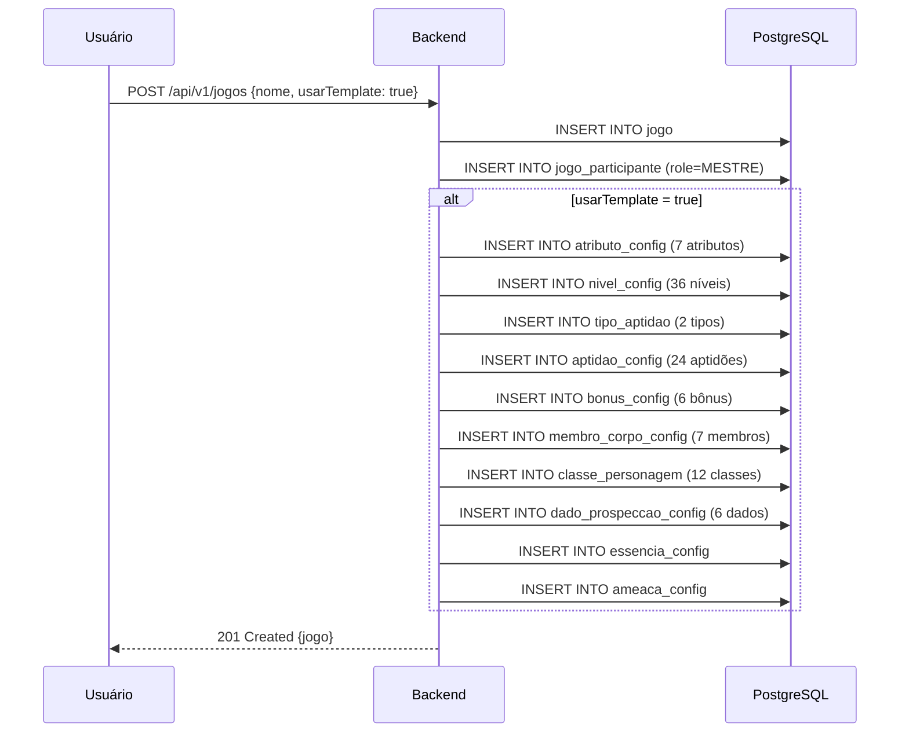
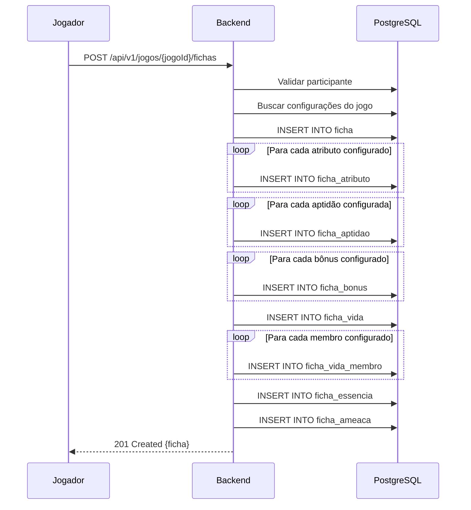

# Quickstart: Backend Klayrah RPG

**Feature Branch**: `001-backend-data-model`  
**Date**: 2026-02-01

## Visão Geral

Este guia fornece as informações necessárias para começar a implementação do backend do Klayrah RPG.

---

## Stack Tecnológica

| Tecnologia | Versão | Uso |
|------------|--------|-----|
| Java | 25 | Linguagem principal |
| Spring Boot | 4.0.2 | Framework web |
| Spring Security | 6.x | Autenticação/Autorização |
| Spring Data JPA | 3.x | Persistência |
| Hibernate Envers | 7.x | Auditoria |
| MapStruct | 1.5.5 | Mapeamento DTO ↔ Entity |
| PostgreSQL | 16+ | Banco de dados |
| Flyway | 10.x | Migrações |
| JUnit 5 | 5.x | Testes |
| Bucket4j | 8.x | Rate limiting |
| SpringDoc | 2.x | OpenAPI/Swagger |

---

## Setup Inicial

### 1. Pré-requisitos

```bash
# Java 25
java --version  # java 25.x.x

# Maven
mvn --version  # Apache Maven 3.9+

# PostgreSQL
psql --version  # psql 16+

# Docker (opcional)
docker --version
```

### 2. Configuração do Banco

```bash
# Via Docker (recomendado)
docker run -d \
  --name klayrah-postgres \
  -e POSTGRES_USER=klayrah \
  -e POSTGRES_PASSWORD=klayrah123 \
  -e POSTGRES_DB=klayrah_rpg \
  -p 5432:5432 \
  postgres:16

# Ou use o compose.yaml existente
docker compose up -d
```

### 3. Variáveis de Ambiente

```bash
# application-dev-local.properties
spring.datasource.url=jdbc:postgresql://localhost:5432/klayrah_rpg
spring.datasource.username=klayrah
spring.datasource.password=klayrah123

# OAuth2 (Google)
spring.security.oauth2.client.registration.google.client-id=YOUR_CLIENT_ID
spring.security.oauth2.client.registration.google.client-secret=YOUR_CLIENT_SECRET
```

### 4. Executar

```bash
# Desenvolvimento
./mvnw spring-boot:run -Dspring-boot.run.profiles=dev-local

# Testes
./mvnw test

# Build
./mvnw clean package
```

---

## Estrutura de Pacotes

```
br.com.hydroom.rpg.fichacontrolador/
├── config/              # Configurações Spring
├── controller/          # REST Controllers
│   └── config/          # Controllers de configuração (Mestre)
├── dto/
│   ├── request/         # DTOs de entrada
│   └── response/        # DTOs de saída
├── exception/           # Exceções customizadas
├── filter/              # Filtros HTTP
├── mapper/              # Interfaces MapStruct
├── model/
│   ├── config/          # Entidades de configuração
│   ├── ficha/           # Entidades de dados da ficha
│   ├── audit/           # Entidades de auditoria
│   └── enums/           # Enums do sistema
├── repository/
│   ├── config/          # Repos de configuração
│   └── ficha/           # Repos de ficha
├── service/
│   └── config/          # Services de configuração
└── util/                # Utilitários
```

---

## Convenções de Código

### Entidades JPA

```java
@Entity
@Audited  // Para tabelas que precisam de histórico
@Table(name = "ficha_atributo")
public class FichaAtributo {
    
    @Id
    @GeneratedValue(strategy = GenerationType.IDENTITY)
    private Long id;
    
    @ManyToOne(fetch = FetchType.LAZY)
    @JoinColumn(name = "ficha_id", nullable = false)
    private Ficha ficha;
    
    @ManyToOne(fetch = FetchType.LAZY)
    @JoinColumn(name = "atributo_config_id", nullable = false)
    private AtributoConfig atributoConfig;
    
    @Column(nullable = false)
    private Integer base = 0;
    
    @Column(nullable = false)
    private Integer nivel = 0;
    
    @Column(name = "outros_bonus", nullable = false)
    private Integer outrosBonus = 0;
    
    @Column(name = "criado_em", nullable = false, updatable = false)
    private LocalDateTime criadoEm;
    
    @Column(name = "atualizado_em", nullable = false)
    private LocalDateTime atualizadoEm;
    
    @PrePersist
    protected void onCreate() {
        criadoEm = LocalDateTime.now();
        atualizadoEm = LocalDateTime.now();
    }
    
    @PreUpdate
    protected void onUpdate() {
        atualizadoEm = LocalDateTime.now();
    }
}
```

### MapStruct Mappers

```java
@Mapper(componentModel = "spring", uses = {AtributoConfigMapper.class})
public interface FichaAtributoMapper {
    
    @Mapping(source = "atributoConfig.nome", target = "nomeAtributo")
    @Mapping(source = "atributoConfig.formulaImpeto", target = "formulaImpeto")
    @Mapping(target = "total", expression = "java(calcularTotal(entity))")
    FichaAtributoResponse toResponse(FichaAtributo entity);
    
    @Mapping(target = "id", ignore = true)
    @Mapping(target = "criadoEm", ignore = true)
    @Mapping(target = "atualizadoEm", ignore = true)
    FichaAtributo toEntity(CriarFichaAtributoRequest request);
    
    @BeanMapping(nullValuePropertyMappingStrategy = NullValuePropertyMappingStrategy.IGNORE)
    void updateFromRequest(AtualizarFichaAtributoRequest request, @MappingTarget FichaAtributo entity);
    
    default Integer calcularTotal(FichaAtributo entity) {
        return entity.getBase() + entity.getNivel() + entity.getOutrosBonus();
    }
}
```

### Controllers

```java
@RestController
@RequestMapping("/api/v1/jogos/{jogoId}/fichas")
@RequiredArgsConstructor
@Tag(name = "Fichas", description = "Gerenciamento de fichas de personagem")
public class FichaController {
    
    private final FichaService fichaService;
    private final FichaMapper fichaMapper;
    
    @GetMapping
    @Operation(summary = "Listar fichas do jogo")
    public ResponseEntity<List<FichaResumoResponse>> listar(
            @PathVariable Long jogoId,
            @AuthenticationPrincipal OAuth2User user) {
        return ResponseEntity.ok(fichaService.listarPorJogo(jogoId, user));
    }
    
    @PostMapping
    @Operation(summary = "Criar nova ficha")
    @ResponseStatus(HttpStatus.CREATED)
    public ResponseEntity<FichaResponse> criar(
            @PathVariable Long jogoId,
            @Valid @RequestBody CriarFichaRequest request,
            @AuthenticationPrincipal OAuth2User user) {
        Ficha ficha = fichaService.criar(jogoId, request, user);
        return ResponseEntity
            .status(HttpStatus.CREATED)
            .body(fichaMapper.toResponse(ficha));
    }
}
```

### Services

```java
@Service
@RequiredArgsConstructor
@Transactional(readOnly = true)
public class FichaService {
    
    private final FichaRepository fichaRepository;
    private final JogoParticipanteRepository participanteRepository;
    private final FichaMapper fichaMapper;
    
    public List<FichaResumoResponse> listarPorJogo(Long jogoId, OAuth2User user) {
        validarAcessoAoJogo(jogoId, user);
        return fichaRepository.findByJogoIdAndAtivaTrue(jogoId)
            .stream()
            .map(fichaMapper::toResumoResponse)
            .toList();
    }
    
    @Transactional
    public Ficha criar(Long jogoId, CriarFichaRequest request, OAuth2User user) {
        JogoParticipante participante = validarAcessoAoJogo(jogoId, user);
        
        Ficha ficha = fichaMapper.toEntity(request);
        ficha.setJogo(participante.getJogo());
        ficha.setUsuario(participante.getUsuario());
        
        return fichaRepository.save(ficha);
    }
    
    private JogoParticipante validarAcessoAoJogo(Long jogoId, OAuth2User user) {
        String email = user.getAttribute("email");
        return participanteRepository.findByJogoIdAndUsuarioEmail(jogoId, email)
            .orElseThrow(() -> new AccessDeniedException("Usuário não participa deste jogo"));
    }
}
```

---

## Endpoints Principais

### Autenticação
| Método | Endpoint | Descrição |
|--------|----------|-----------|
| GET | `/oauth2/authorization/google` | Iniciar login Google |
| GET | `/api/v1/auth/me` | Dados do usuário atual |
| POST | `/api/v1/auth/logout` | Logout |

### Jogos
| Método | Endpoint | Descrição |
|--------|----------|-----------|
| GET | `/api/v1/jogos` | Listar jogos do usuário |
| POST | `/api/v1/jogos` | Criar jogo (usuário vira Mestre) |
| GET | `/api/v1/jogos/{id}` | Detalhes do jogo |
| PUT | `/api/v1/jogos/{id}` | Atualizar jogo (Mestre) |
| DELETE | `/api/v1/jogos/{id}` | Arquivar jogo (Mestre) |

### Configuração do Jogo (Mestre)
| Método | Endpoint | Descrição |
|--------|----------|-----------|
| GET | `/api/v1/jogos/{jogoId}/config/atributos` | Listar atributos |
| POST | `/api/v1/jogos/{jogoId}/config/atributos` | Criar atributo |
| PUT | `/api/v1/jogos/{jogoId}/config/atributos/{id}` | Atualizar atributo |
| POST | `/api/v1/jogos/{jogoId}/config/template/klayrah` | Aplicar template |

### Fichas
| Método | Endpoint | Descrição |
|--------|----------|-----------|
| GET | `/api/v1/jogos/{jogoId}/fichas` | Listar fichas |
| POST | `/api/v1/jogos/{jogoId}/fichas` | Criar ficha |
| GET | `/api/v1/jogos/{jogoId}/fichas/{id}` | Detalhes da ficha |
| PUT | `/api/v1/jogos/{jogoId}/fichas/{id}` | Atualizar ficha |
| DELETE | `/api/v1/jogos/{jogoId}/fichas/{id}` | Arquivar ficha |
| GET | `/api/v1/jogos/{jogoId}/fichas/{id}/historico` | Histórico (Mestre) |

---

## Fluxo de Criação de Jogo



---

## Fluxo de Criação de Ficha



---

## Testes

### Estrutura de Testes

```
src/test/java/
├── controller/
│   └── FichaControllerTest.java      # Testes de API
├── service/
│   └── FichaServiceTest.java         # Testes de lógica
├── mapper/
│   └── FichaMapperTest.java          # Testes de mapeamento
└── integration/
    └── FichaIntegrationTest.java     # Testes E2E
```

### Exemplo de Teste

```java
@WebMvcTest(FichaController.class)
class FichaControllerTest {
    
    @Autowired
    private MockMvc mockMvc;
    
    @MockBean
    private FichaService fichaService;
    
    @Test
    @WithMockUser
    void deveCriarFicha() throws Exception {
        // Arrange
        var request = new CriarFichaRequest("Aragorn", 1L, 1L);
        var response = new FichaResponse(1L, "Aragorn", ...);
        when(fichaService.criar(any(), any(), any())).thenReturn(response);
        
        // Act & Assert
        mockMvc.perform(post("/api/v1/jogos/1/fichas")
                .contentType(MediaType.APPLICATION_JSON)
                .content(objectMapper.writeValueAsString(request)))
            .andExpect(status().isCreated())
            .andExpect(jsonPath("$.nomePersonagem").value("Aragorn"));
    }
}
```

---

## Referências

- [data-model.md](./data-model.md) - Modelo de dados completo
- [seed-data.md](./seed-data.md) - Dados de seed do template Klayrah
- [research.md](./research.md) - Decisões técnicas
- [spec.md](./spec.md) - Especificação funcional
